# KeyGen1
Created by Tyr Rex.

The company's **username is `RazorPower`**. Generate a valid license key using
the company's username. The flag format is `flag{<LICENSE-KEY-HERE>}`.
<details>
    <summary>Flag</summary>
    <code>flag{FPSKVAAA-PLTAQFKD-XHJLBAGI-OZCLGKBQ}</code>
</details>

## Files Provided
- `cool_software`

## Tools
- Ghidra
- Python

## Steps to Solve

<details>
<summary>Steps to Solve</summary>

### Introduction
We are given a binary `cool_software`.

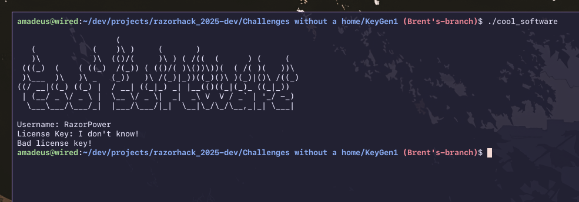  
*Figure 1. Output of `cool_software` after running and interacting with it.*

Important things to keep in mind
- It prints `Username: `, then reads in an input
- It prints `License Key: `, then reads in an input
- From the problem description, we know we have to input `RazorPower` when it asks for the username.

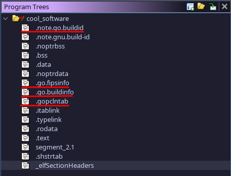  
*Figure 2. The underlined sections show it is a Go binary.*

We import the binary to Ghidra.
- Figure 2 indicates that the given binary was made with Go.
- Running `file` on the binary shows us that it's stripped.
  - Since the binary is stripped, I used some Ghidra scripts from getCUJO's "Threat Intel"
    repository [1]. Dorkay Palotay talks about the theory behind the scripts in her article "Reverse
    Engineering Go Binaries with Ghidra" [2].
    - The repo and article is a bit old so I had to tweak their `go_func.py` script.
  - There are some other software like [GoReSym](https://github.com/mandiant/GoReSym)
    [3].

---

### User Input

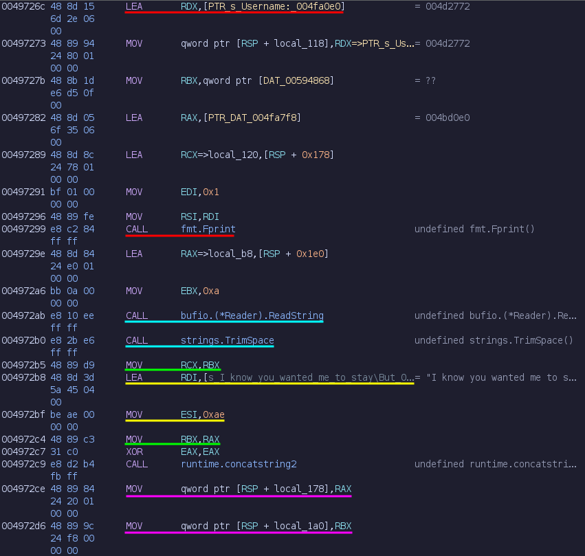  
*Figure 3. Part of the program that prompts and reads for the username.*

This part has different parts to it, so I've underlined each part in different colors.
- The red part prints `Username: `.
- The cyan part reads in a string from the terminal and cleans it up by removing the leading and
  trailing whitespace.
- The green, yellow, and purple parts all work together to concatenate something to the cleaned up
  string from the cyan part.
  - The green part is moving `RBX` into `RCX` and `RAX` into `RBX`. This is moving the result, a
    string, of the call to `strings.TrimSpace` as the arguments to `runtime.concatstring2` later in
    the purple part [4].
    - Functions uses the same registers to pass arguments and return data from and to functions, in
      a specific order. The order can be found in Go's internal ABI spec, with the first five
      registers being `RAX`, `RBX`, `RCX`, `RDI`, and `RSI` in amd64 [5].
    - Strings are made up of a pointer, pointing to the string, and an integer, signifying how long
      the string is [6].
  - The yellow part is loading an address, `0x4db819`, into `RDI` and a constant integer, 0xAE, to
    `ESI`. This is likely a string since it's being moved as an argument to `runtime.concatstring2`
    as well. We can figure out what the string is later. The address was found by looking at the
    instruction info since Ghidra displays a labeled version.
  - The purple part finally calls the `runtime.concatstring2` function and stores the result to the
    stack in `[RSP + local_178]` and `[RSP + local_1a0]`. These are labeled version. The unlabeled
    versions are `[RSP + 0x120]` and `[RSP + 0xf8]`

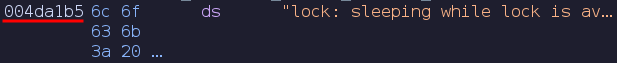  
*Figure 4. The string Ghidra shows when following the address used in the `runtime.concatstring2`
call from the yellow part in figure 3.*

If we follow the address we see figure 4. Normally strings are null-terminated, however Go stores
its strings as one big string, the "base string". Other strings use a pointer to the base string as
the start of the string, and then uses a length to determine the end of the string.

We can write a python script to extract the string concatenated to the username.
```python
with open('data.txt', 'r') as f: 
    ptr = 0x4db819 - 0x4da1b5 # 0x4da1b5 is the address of the base string from figure 4.
    len = 0xae                # 0xae is the length of the string from figure 3.
    concat = f.read()[ptr : ptr + len] # final string
```
- The data was copied into `data.txt` by right-clicking the string shown in figure 4, clicking "Copy
  Special..." and using "Data" then pasting into the file.
- Ghidra automatically adds a `"` at the beginning and end of the string, so those were removed
  since they are not part of the actual string and messes up the address calculation.

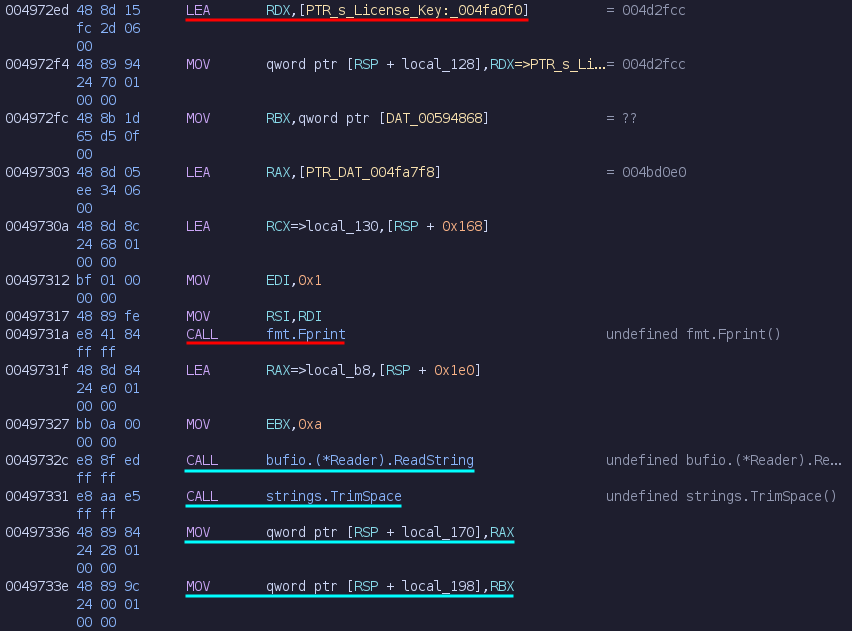
*Figure 5. Part of the program that prompts and reads for the license key.*

We expect for this part to appear since the program also asks for a license key as seen from
figure 1. This works similarly to the red and cyan parts of figure 3. The result of
`strings.TrimSpace` is stored in `[RSP + local_170]` and `[RSP + local_198]`, or `[RSP + 0x128]` and
`[RSP + 0x100]`.

**In summary, this section gets the user input for the username and license key. It also
concatenates some random string to the username.**

---

### Key Generation
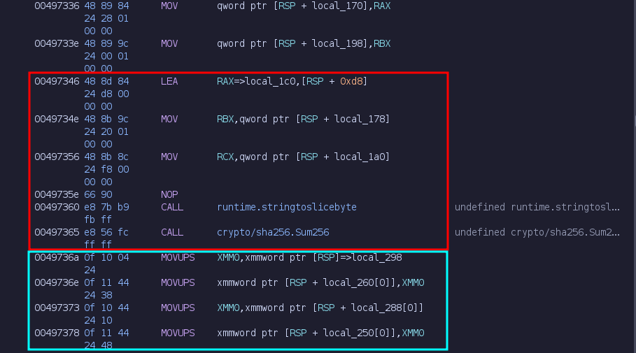
*Figure 6. Hashing the concatenated username.*

This hashes the concatenated username using SHA256 and stores it into a byte array of length 32.
- In the red part, it loads an address on the stack to `RAX` and the concatenated username string to
  `RBX` and `RCX`. It then calls `runtime.stringtoslicebyte` and `crypto/sha256.Sum256`.
  - `runtime.stringtoslicebyte` has a function signature of  
    ```go
    // https://github.com/golang/go/blob/master/src/runtime/string.go [6]
    func stringtoslicebyte(buf *tmpBuf, s string) []byte
    ```
    which corresponds to the arguments passed into `RAX`, `RBX`, and `RCX`.
- The cyan part uses an `XMM` register which has a size of 16 bytes to move the result from the
  stack frame of the call to `crypto/sha256.Sum256` to the current stack frame [7]. It does this
  twice since `crypto/sha256.Sum256` returns a byte array of length 32.
  - The result is moved into `[RSP + local_260]` or `[RSP + 0x38]`.

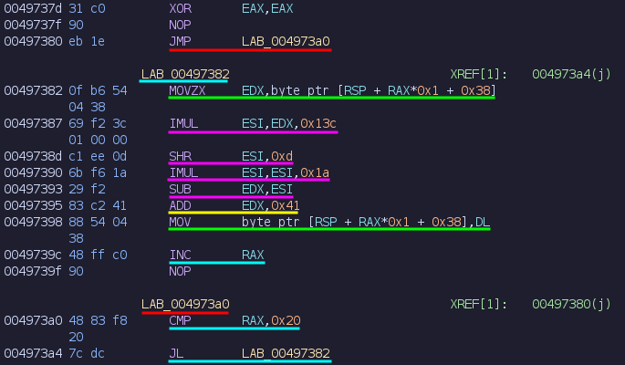  
*Figure 7. Making each byte of the SHA256 byte array is a capital alphabetic ASCII character.*

Figure 7 resembles a for-loop. This loop makes each byte of the SHA256 byte array be between 65 to
90 inclusive.
- In the first line, the register `EAX` is set to 0 by XORing itself. This will be used as the index
  of the loop.
- The red part enters the loop by immediately checking the loop condition, the cyan part.
- The cyan part checks the loop condition which is that the index is less than 0x20. It also loops
  back to the main body of the loop if the condition is met and increments the index at the end.
- The green part is moving an element from the SHA256 byte array, `[RSP + 0x38]`, into `EDX`. After
  the purple and yellow parts. It moves a value from a register to the same address it moved an
  element from. This mutates the element at the current index.

For the purple and yellow sections, it is much more helpful to look at the decompilation of this
part of the program.

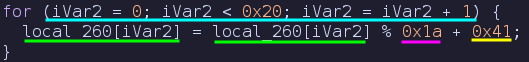  
*Figure 8. Decompilation of figure 7 with the corresponding sections underlined.*

The red part isn't included since it was just entering the for-loop. The purple and yellow parts are
performing an optimized modulo operation and addition operation to the current element.

**In summary, this section generates an array of bytes of length 32 by hashing the concatenated
username using SHA256. Each byte in the SHA256 byte array is then ensured to be between 65 to 90
inclusive to be a capitalized alphabetic ASCII character.**

---

### Key Formatting

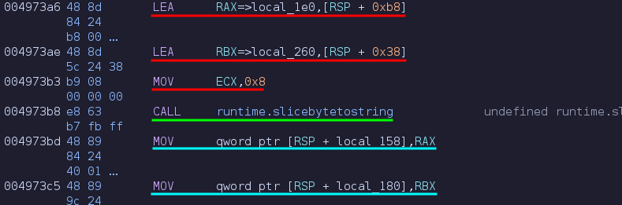  
*Figure 9. Converting the first eight bytes of the SHA256 array into a string.*

This converts the first eight bytes of the SHA256 array into a string using the function
`runtime.slicebytetostring` as seen in the green section. The function signature of the function is 
```go
// https://github.com/golang/go/blob/master/src/runtime/string.go [6]
func slicebytetostring(buf *tmpBuf, ptr *byte, n int) string
```
- The red part moves the arguments needed for the needed for the call in the green part.
  - The first red line corresponds to `buf *tmpBuf`.
  - The second red line corresponds to `ptr *byte`. This is the pointer to the SHA256 array,  
    `[RSP + 0x38]`.
  - The third red line corresponds to `n int`. This is how many of the bytes of the SHA256 array
    should be used from the beginning.
- The green part calls the `runtime.slicebytetostring` function, converting the first eight bytes of
  the SHA256 array to a string.
- The cyan part moves the result, a string, to the stack `[RSP + local_158]` and
  `[RSP + local_180]`, or `[RSP + 0x140]` and `[RSP + 0x118]`.

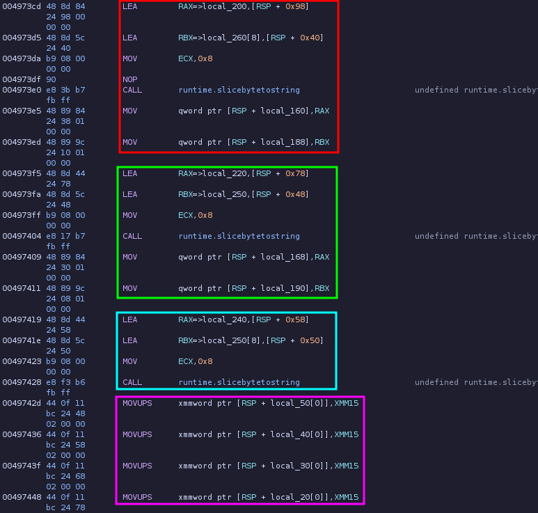  
*Figure 10. Converting the second, third, and fourth eight bytes of the SHA256 array into a string.*

- The red and green parts are similar to figure 9, converting the second and third eight bytes of
  the SHA256 array into a string and storing them onto the stack.
- The cyan part is also similar to figure 9, however it does not store the result in the stack.
  Instead, it keeps the result in the registers.
- The purple part is using `XMM` registers to "initialize" an array on the stack with 64 bytes. The
  array is starts at the address `[RSP + local_50]` or `[RSP + 0x248]`.

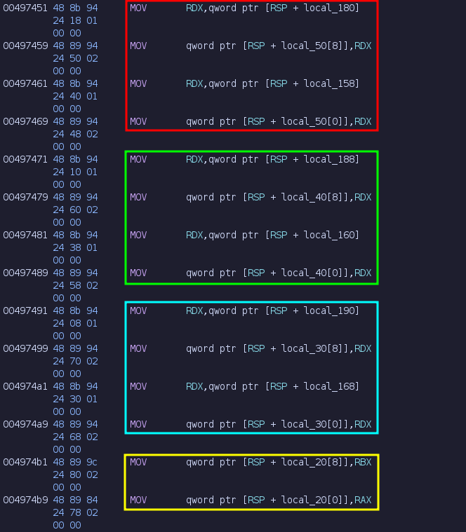  
*Figure 11. Moving the strings from the stack to the array.*

- The red, green, and cyan parts copy the first, second, and third strings that was created in
  figures 9 and 10 from the stack into the array in the stack created from the purple part of figure
  10.
- The yellow part copy the string that was created in the cyan part of figure 10 from the register
  to the array.
- The array's size of 64 bytes is perfect for 4 strings since each string has a size of 16 bytes
  (8 bytes for the pointer and 8 bytes for the length).


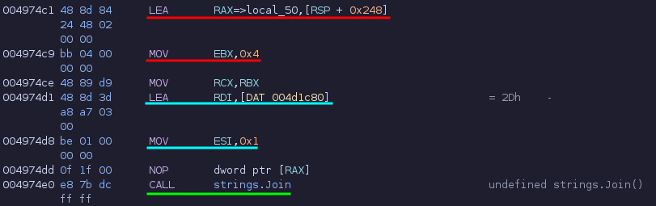  
*Figure 12. Joining the strings in the array by a separator.*

This joins the strings in the array `[RSP + 0x248]` by a separator through the function
`strings.Join`. The function signature of `strings.Join` is 
```go
// https://pkg.go.dev/strings [4]
func Join(elems []string, sep string) string
```
- The red part corresponds to `elems []string`. It moves the address of the start of the array from
  figure 10 and 11, `[RSP + 0x248]` and its length into `RAX` and `EBX` respectively.
- The cyan part corresponds to `sep string`. It moves the address of the separator string, `-`, and
  its length of 0x1 into `ESI`.
- The green part finally calls the `strings.Join` to join the strings together by the separator.
---

### Checking the Key

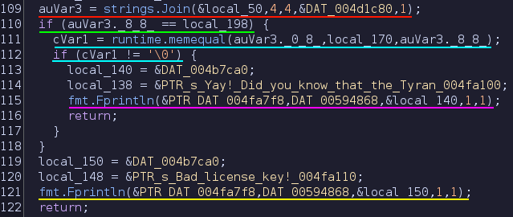  
*Figure 13. Checking if the inputted license key matches the joined string from figure 12.*

In this section, It's easier to look at the decompiled version of the program instead of the
straight assembly.
- In the red section, we see the string result, `auVar3`, from the `strings.Join` shown in figure
  12.
- In the green section, we see the length of `auVar3`, stored in `auVar3._8_8_`, being compared to
  `local_198`.
  - From figure 5, we found that the user input for the License Key was stored in  
    `[RSP + local_170]` and `[RSP + local_198]`. The length is stored in `[RSP + local_198]`, or in
    the decompilation window, `local_198`.
- In the cyan section, we finally check if `local_170`, the contents of the user input for the
  License Key, is equal to the contents of `auVar3`, stored in `auVar3._0_8_`.
  - `runtime.memequal` returns a bool, so a result of **anything but** a 0 is true. This tripped me
    up a little since C's `strcmp` returns a 0 if two strings are equal.
- In the purple section, we print a little happy message and a fun fact if the two strings are
  equal, signifying that the License Key is valid and that we've solved the challenge.
- In the yellow section, we print a `"Bad License Key"` message if the two strings aren't equal,
  signifying that we haven't solved the challenge.

---

### Key Generator

Now that we know how the program works overall, we can write our key generator script.
```py
# User Input
with open('data.txt', 'r' as f:
    ptr = 0x4db819 - 0x4da1b5 # 0x4da1b5 is the address of the base string from figure 4.
    len = 0xae                # 0xae is the length of the string from figure 3.
    concat = f.read()[ptr : ptr + len] # final string

username = "RazorPower" + concat # We know that the username has to be RazorPower

# Key Generation
from hashlib import sha256
sha256_arr = list(sha256(username.encode()).digest())

for i in range(0x20):
    sha256_arr[i] = sha256_arr[i] % 0x1a + 0x41

# Key Formatting
a = ''.join(chr(c) for c in sha256_arr[0x00:0x08]) 
b = ''.join(chr(c) for c in sha256_arr[0x08:0x10])
c = ''.join(chr(c) for c in sha256_arr[0x10:0x18])
d = ''.join(chr(c) for c in sha256_arr[0x18:0x20])

formatted = '-'.join([a, b, c, d])
print(formatted)

# From the challenge description, the flag format is `flag{<LICENSE-KEY-HERE>}`
print(f"flag{{{formatted}}}")
```

### References
[1] Threat Intel - getCUJO.
    https://github.com/getCUJO/ThreatIntel/tree/master/Scripts/Ghidra

[2] Reverse Engineering Go Binaries with Ghidra - Dorka Palotay.
    https://cujo.com/blog/reverse-engineering-go-binaries-with-ghidra/

[3] GoReSym - mandiant. https://github.com/mandiant/GoReSym

[4] Strings Package - Golang. https://pkg.go.dev/strings

[5] Go Internal ABI Specification - Golang.
    https://go.googlesource.com/go/+/refs/heads/dev.regabi/src/cmd/compile/internal-abi.md

[6] Source file src/runtime/string.go - Golang.
    https://github.com/golang/go/blob/master/src/runtime/string.go

[7] x86 Assembly/SSE - Wikibooks. https://en.wikibooks.org/wiki/X86_Assembly/SSE
</details>
