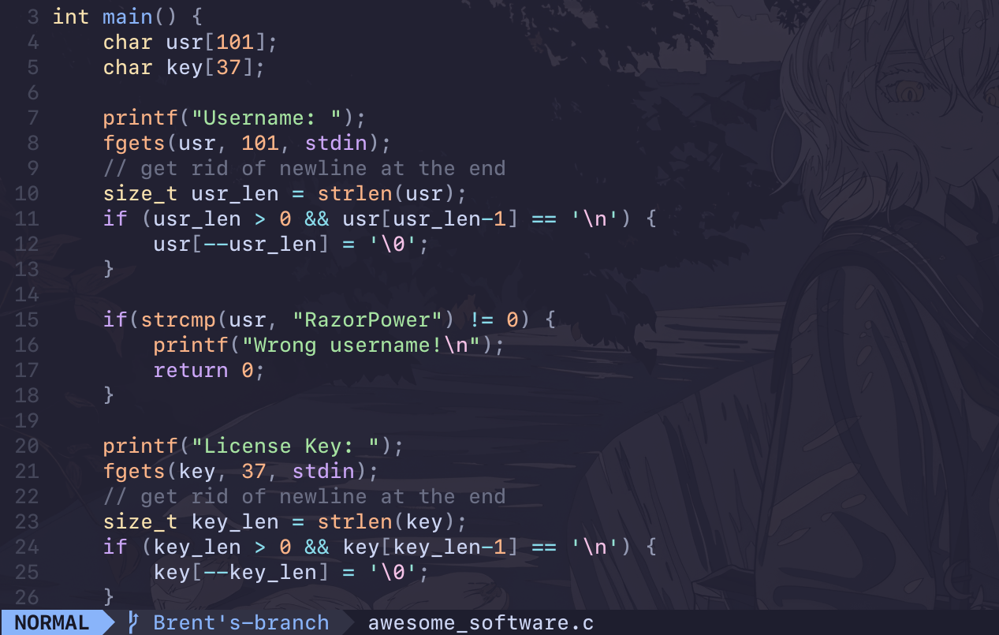
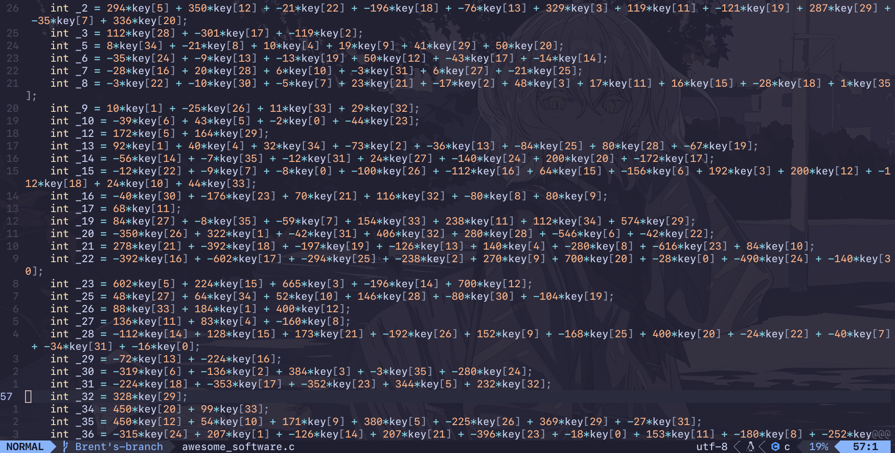
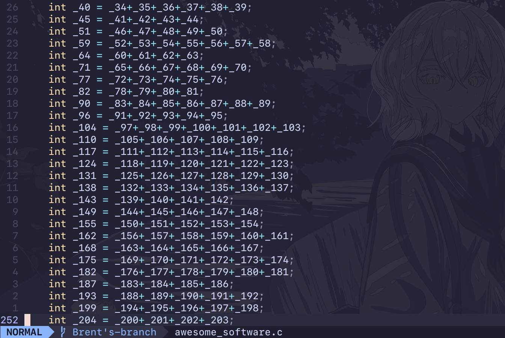
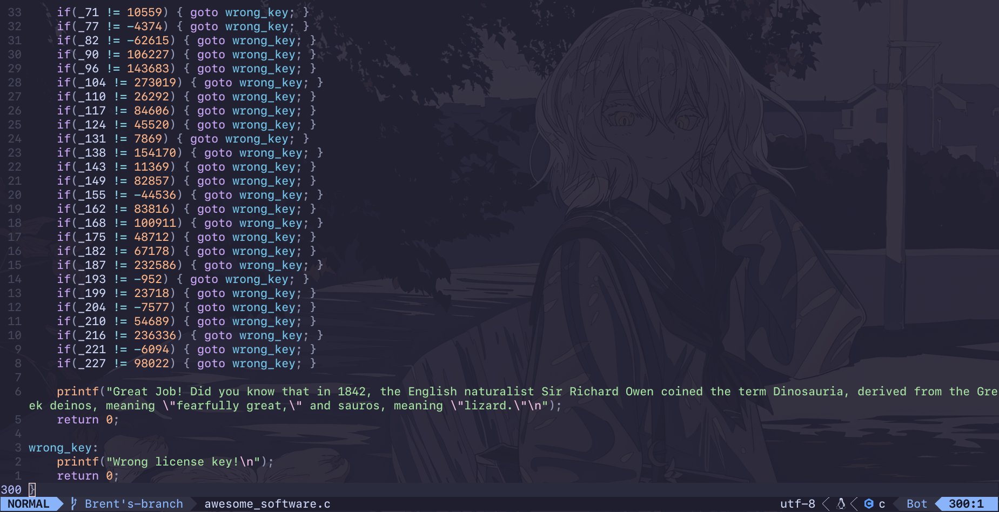
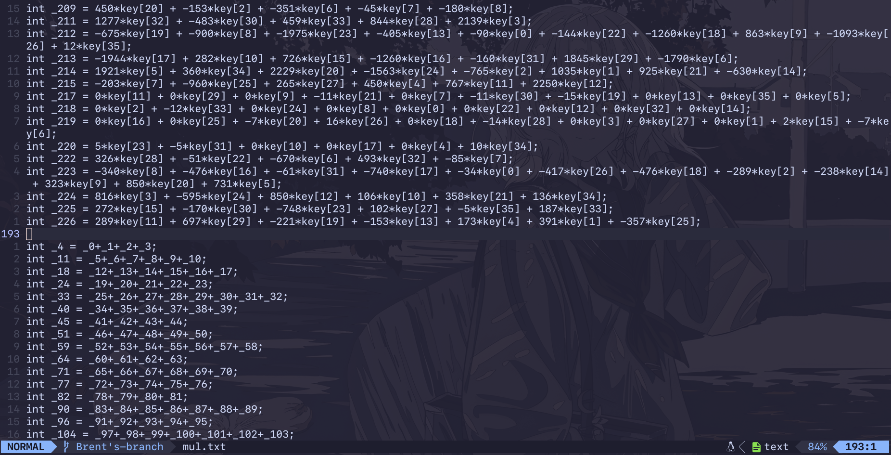
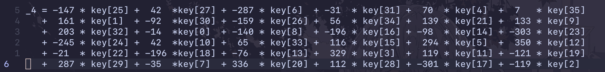
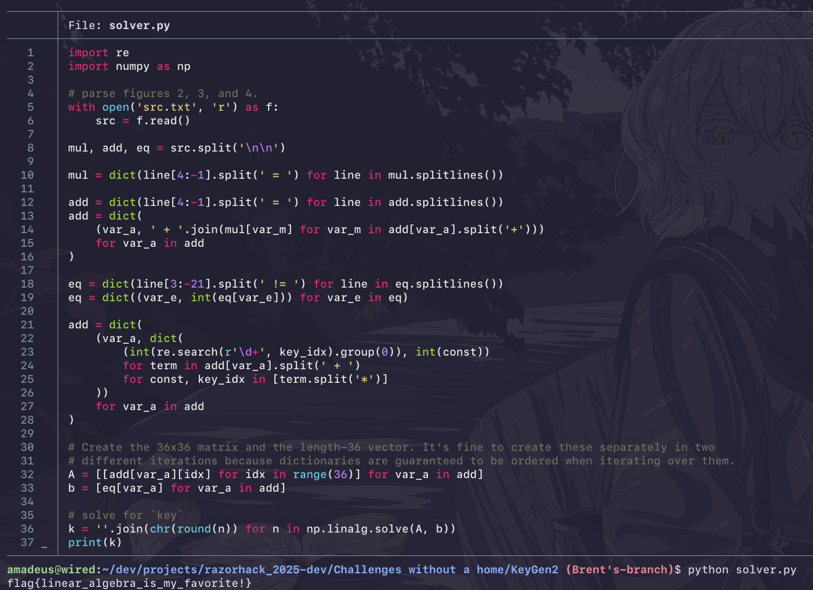

# KeyGen2
Created by Tyr Rex.

<details>
    <summary>Flag</summary>
    <code>flag{linear_algebra_is_my_favorite!}</code>
</details>

## Files Provided
- `awesome_software.c`

## Tools
- Python

## Steps to Solve

<details>
<summary>Steps to Solve</summary>

### Introduction
We are given a file `awesome_software.c`. It's split into four main parts:
- gathering input
- `key` multiplication and addition
- a bunch of addition
- equality checking

  
*Figure 1. Gathering input.*

  
*Figure 2. `key` multiplication and addition.*

  
*Figure 3. A bunch of addition.*

  
*Figure 4. Checking for equality.*

We see in figure 1 that it takes in a `username` and `key`. It checks if `username` is equal to
`RazorPower`. The `key` variable is used in figures 2, 3, and 4.

In figure 2, characters of `key` are multiplied by some constants and are added together and set to
a variable. In figure 3, variables from figure 2 are added together. Finally in figure 4, the
variables from figure 3 are checked to be equal to some constants. More accurately, it's checked if
it's not equal to some constants, and it `goto`s to the `wrong_key` label signifying the input for
`key` is wrong. If the input for `key` is correct, then the program prints a fun fact. We can assume
that the correct input for `key` is the flag for the challenge.

It is important to note that the inputted string for `key` is of length 36 since the last element is
reserved for the null terminator.

### Parsing the File

Let's focus on figures 2 and 3 for now. We can simplify figure 2 and 3 into one part if we
substitute the variables in figure 3 to what they're equal to in figure 2.

We can put figures 2 and 3 in a file by itself and parsing it with a python script.

  
*Figure 5. Putting the parts of `awesome_software.c` that's in figures 2 and 3 to `src.txt`.*
```py
with open('mul.txt', 'r') as f:
    src = f.read()

mul, add = src.split('\n\n')

# split by ' = ' with variable name as key and what it's equal to as value.
mul = dict(line[4:-1].split(' = ') for line in mul.splitlines())
add = dict(line[4:-1].split(' = ') for line in add.splitlines())

# replace each variable, `var_m`, in `add[var_a]` with `mul[var_m]`.
add = dict(
    ( var_a, ' + '.join(mul[var_m] for var_m in add[var_a].split('+')) )
    for var_a in add
)
```
*Figure 6. Python script that parses the file `src.txt`.*

Okay, now let's parse figure 4. We're gonna do something similar when we parsed figures 2 and 3. We
can put figure 4 in the same file, `src.txt`

```py
...
# We added `eq` since we added a new part in `src.txt`
mul, add, eq = src.split('\n\n') 
...
# Split on ' != ' and turn the rhs into an int.
# The lhs variable should be equal to the rhs.
eq = dict(line[3:-21].split(' != ') for line in eq.splitlines())
eq = dict((var_e, int(eq[var_e])) for var_e in eq)
```
*Figure 7. Python script that paarses the file in `src.txt` with figure 4 included.*

Figure 4 is now parsed into a dict, `eq`, with the key as the variable and the value as the integer the
variable should be equal to.

### Matrix Multiplication

Let's take a look at one of the variables in `add`.

  
*Figure 8. `add['_4']` after substitution.*

`add['_4']` can be expressed as a dot product between a 36-length vector, `a_4` of the constants and each
element in `key`. At the end of `aweseome_software.c`, it checks whether it is equal to a constant
which is stored in `eq['_4']`. So, we can express this whole thing as `a_4 * key = eq['_4']`

We can express every variable in `add` as the above, so we can express the whole thing as 
`add * key = eq`. Then, we must solve for `key` since it is our input. This is easy because linear
algebra and NumPy.

In our Python script however, it's not very easy to solve for `key` quite yet because `add` and `eq`
are dicts. Let's make a 36x36 matrix and a length-36 vector using them.

```python
...
import re
add = dict(
    (var_a, dict(
        (int(re.search(r'\d+', key_idx).group(0)), int(const))
        for term in add[var_a].split(' + ')
        for const, key_idx in [term.split('*')]
    ))
    for var_a in add
)

# Create the 36x36 matrix and the length-36 vector. It's fine to create these separately in two
# different iterations because dictionaries are guaranteed to be ordered when iterating over them.
A = [[add[var_a][idx] for idx in range(36)] for var_a in add]
b = [eq[var_a] for var_a in add]

# solve for `key`
import numpy as np
kkey = ''.join(chr(round(n)) for n in np.linalg.solve(A, b))
print(key)
```
*Figure 9. Creating a 36x36 matrix and length-36 vector using `add` and `eq` and solving for `key`*

Et voila, we find the flag for the challenge: `flag{linear_algebra_is_my_favorite}`.



Yay.
</details>

