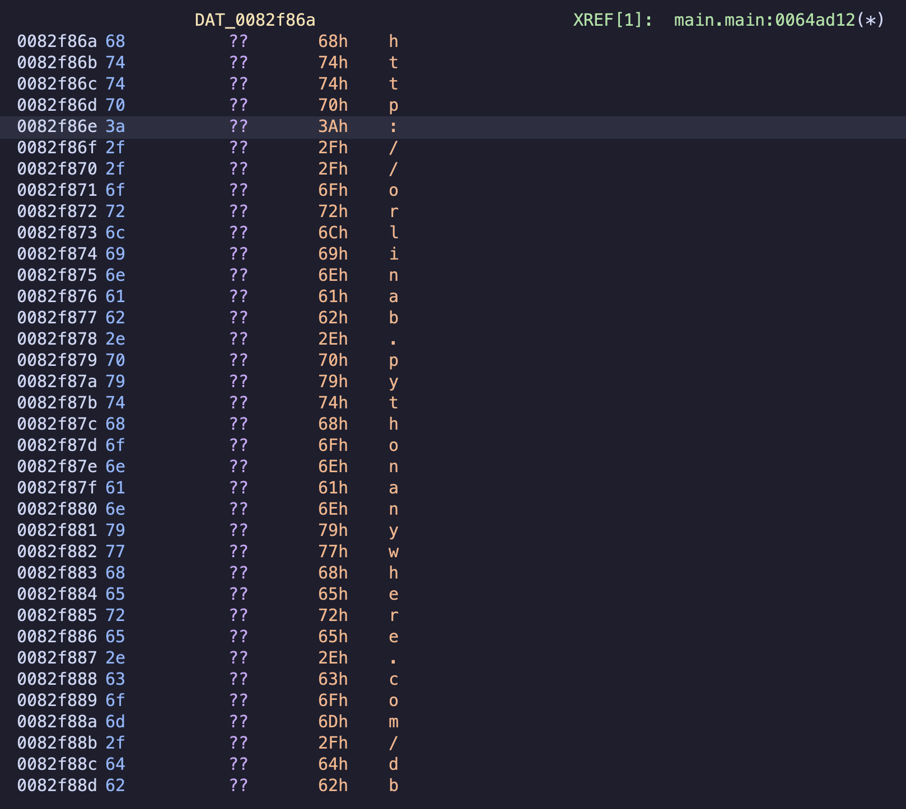

# KeyGen3
Created by Tyr Rex.

Reminder that the company name is RazorPower

<details>
    <summary>Flag</summary>
    <code>flag{5ql173_f0r_d4_w1nz}</code>
</details>

# Files Provided
- `i_ran_out_of_names_software`

# Tools
- Ghidra
- Python

# Steps to Solve

<details>
<summary>Steps to Solve</summary>

## Introduction

We are given an awesomely-named stripped binary, `i_ran_out_of_names_software`.

Let's load it into Ghidra.

## Ghidra

  
*Figure 1. Decompiled part of `i_ran_out_of_names_software` in Ghidra after using GoReSym, finding
the main function `main.main` and browsing around.*

I used some GoReSym to recover function names with the command
`GoReSym -t -d -p i_ran_out_of_names_software > i_ran_out_of_names_software.json`. Then I used the
provided Ghidra script on their GitHub to port the information to Ghidra [1]

On figure 1, we can see that it's using the `net/http` library in the Go standard library to
download something. If we look up `net/http.(*Client).Get`'s function signature, we find that it is
```Go
func (c *Client) Get(url string) (resp *Response, err error)
```
thus we can guess that in figure 1, the first argument is the pointer `c *Client`, and the other two
are the `url string` [2]. We know that strings in Go are made up of a pointer and a length. So the
string we're passing in is of length `0x24`.

If we follow the pointer to the string, we see:
  
*Figure 2. Following the string from `net/http.(*Client).Get` from figure 1.*

We see the string `http://orlinab.pythonanywhere.com/db` which is of length `0x24`. This fits what
we see in figure 1.

## SQLite Stuff

If we visit the url from figure 2, we download a `.db` file. Let's run `file` on it.
```sh
$ file i_ran_out_of_names_database.db
i_ran_out_of_names_database.db: SQLite 3.x database, last written using SQLite version 3042000, file counter 4, database pages 13, cookie 0x1, schema 4, UTF-8, version-valid-for 4
```

It's a SQLite3 file. Let's use Python to find out what's in there.
```py
import sqlite3
con = sqlite3.connect('i_ran_out_of_names_database.db')
cur = con.cursor()

# Find Table Names
_ = cur.execute("SELECT name FROM sqlite_master WHERE type='table'")
print(cur.fetchall())
```

We find that the only table is `customer`. Let's get the first few rows and the column names to see
what it's storing.
```py
import sqlite3

con = sqlite3.connect('i_ran_out_of_names_database.db')
cur = con.cursor()

res = cur.execute("SELECT * FROM customer LIMIT 8")
# Gets column names
print([desc[0] for desc in cur.description])
# Print rows
print('\n'.join(str(row) for row in cur.fetchall()))
```

We get the output
```
['company_name', 'license_key']
('Erie Insurance Group', 'lagf{R5MtnUF1_ND97Yb7oSV}')
('Graybar Electric', 'glfa{mwJJtqawXj_PXRJ9Yy_98T0ne0Np0l}')
('Archer Daniels Midland', 'galf{LeMbsJ2_E2G9cFrb}')
('TransUnion', 'lafg{lTAEaIhs7n_5Y9IMDMxvk}')
('Valmont Industries', 'afgl{P88hdOxmC3TZ_UsaRlA1hdzBg_i4YNrci8HWD}')
('Advantage Solutions', 'algf{JyfR4Adz_3tjegDmHC64j}')
('IDEXX Laboratories', 'glfa{HFA1MK_L76tMW}')
('Cigna', 'lagf{EuOTtvCEBIp}')
```

So it's storing a `company_name` and a `license_key`. So we just need to get the key for our company
`RazorPower`.
```py
import sqlite3

con = sqlite3.connect('i_ran_out_of_names_database.db')
cur = con.cursor()

# Get license_key for RazorPower
res = cur.execute("SELECT license_key FROM customer where company_name = 'RazorPower'")
print('\n'.join(row[0] for row in cur.fetchall()))
```

We get `flag{5ql173_f0r_d4_w1nz}`. woot \\(^_^)/

## References

[1] GoReSym - mandiant. https://github.com/mandiant/GoReSym

[2] Golang Standard Library. https://pkg.go.dev/net/http#Client.Get

</details>
