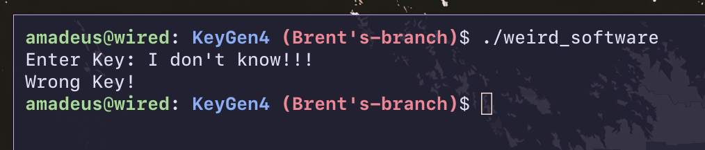
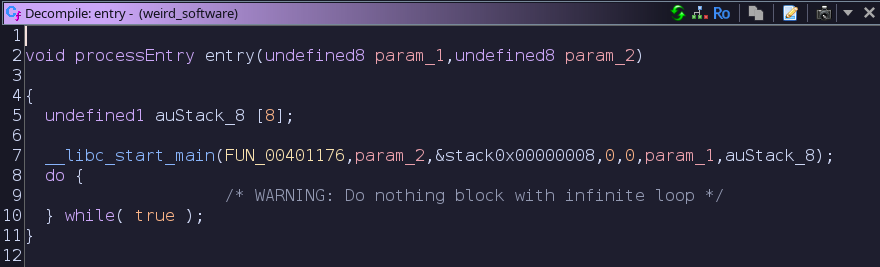
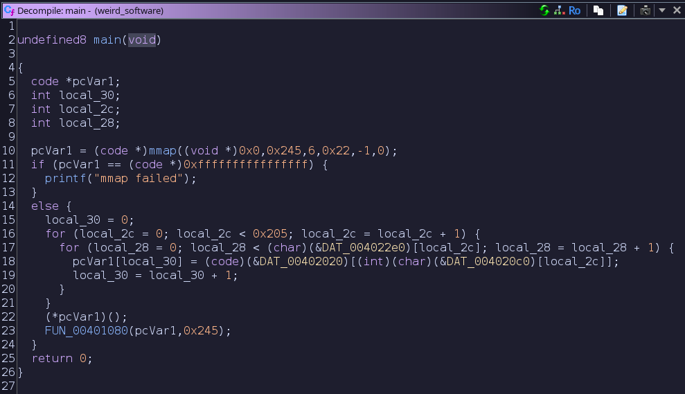
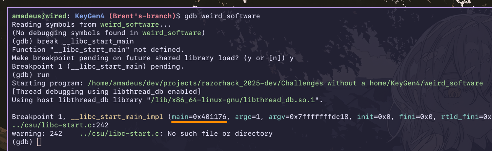
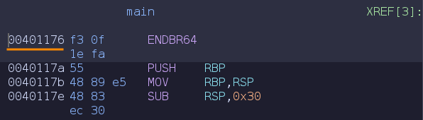
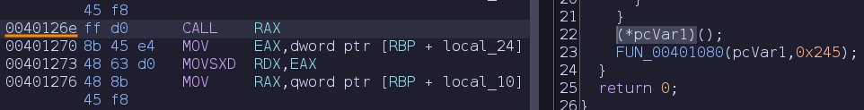
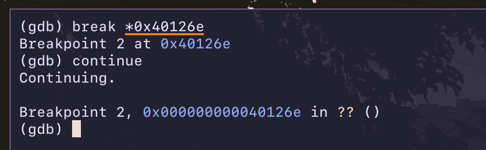
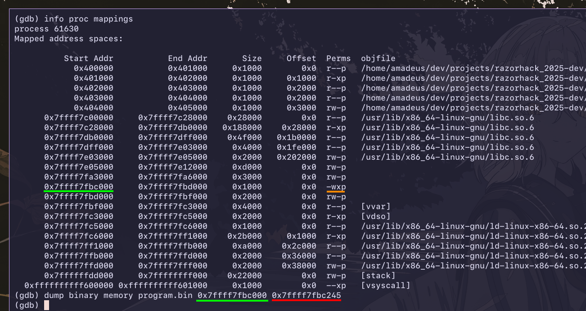
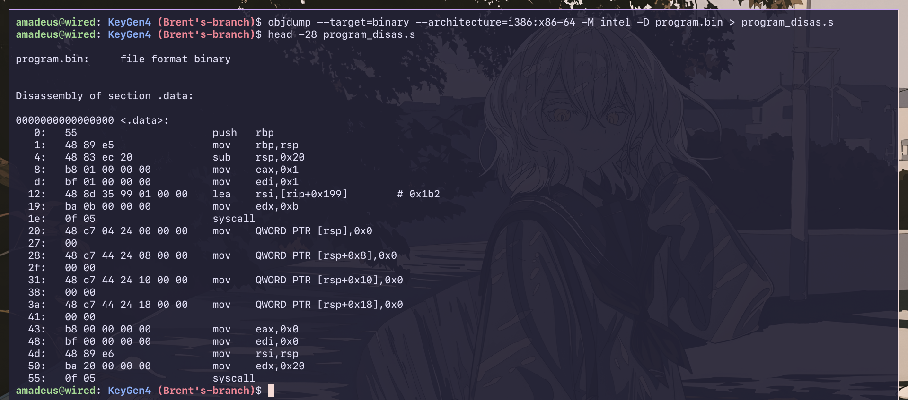

# KeyGen4
Created by Tyr Rex.

<details>
    <summary>Flag</summary>
    <code>flag{3ucl1d_15_50_4w350m3_54uc3}</code>
</details>

# Files Provided
- `weird_software`

# Tools
- Ghidra
- Python

# Steps to Solve

<details>
<summary>Steps to Solve</summary>

## TL;DR

`weird_software` writes some machine code in memory and executes it. We use Ghidra to understand
what the program is doing, use GDB to extract the machine code written in memory, use `objdump` to
disassemble the machine code, then use Python to solve the problem (finding modular multiplicative
inverses) in the disassembly.

## Introduction

We are given a stripped binary, `weird_software`.

  
*Figure 1. Running `weird_software`.*

Let's load it to Ghidra.
  
*Figure 2. Decompilation of the entry point of `weird_software`.*

According to the function definition of `libc_start_main` ,
```C
int __libc_start_main(int (*main) (int, char **, char **), int argc, ...);
```
the first argument is a function pointer to the main function thus `FUN_00401176` from figure 2 is
the main function. It can be renamed to `main` for future clarity [[1]](#References).

Here is the decompilation of the main function:

  
*Figure 3. Decompilation of the main function in `weird_software`.*

## Calling `mmap`

On line 10 of figure 3, it calls the system call `mmap`.

`mmap` is a linux system call that maps files or devices into memory [[2]](#References). Its
function call is
```C
void *mmap(
    void *__addr,
    size_t __len,
    int __prot,
    int __flags,
	int __fd,
    off_t __offset
);
```

In figure 3, it is called with the arguments
```C
mmap((void *)0x0, 0x245, 6, 0x22, -1, 0)
```

- Since `void *__addr` is NULL (i.e. 0) the kernel chooses where to create the mapping.
- The size of the new mapping is `0x245` bytes.
- The argument `int __prot` uses bit flags, specifically `PROT_NONE`, `PROT_READ`, `PROT_WRITE`, and
`PROT_EXEC` [[2]](#References).
  - The argument `6` corresponds to `PROT_WRITE` and `PROT_EXEC` meaining, that the **program can
    write to and execute the requested memory mapping** [[3]](#References).
- The argument `int __flags` uses bit flags [[2]](#References). There's handful so I won't list them.
  - The argument `0x22` corresponds to `MAP_ANONYMOUS` and `MAP_PRIVATE` [[3]](#References).
- The argument `int __fd` specifies a file descriptor i.e., the file that the `mmap` is mapping into
  memory [[2]](#References).
  - Since the provided argument is `-1` and `MAP_ANONYMOUS` is being used, the program is not
    actually mapping a file into memory. It is simply initialized to zeroes. [[2]](#References)
- The `off_t __offset` argument specifies the offset from the beginning of the file that `mmap`
  should be mapping the contents from [[2]](#References).
  - Since the program is not actually mapping a file into memory, the offset is `0`.

**In summary**, the program is allocating memory with the size `0x245` that is writable and
executable.

## Using GDB 

On lines 15-21 of figure 3, the program writes to memory allocated by `mmap` on line 10. On line 22,
the program executes that part of memory by doing a function call on it.

We now need to figure out what is being written and executed to that allocated memory since that is
where the meat of the program seems to be. Since all of the data is in the program, it is feasible
to grab all the const data in the memory and recreate what's being written in memory. However, i'm
lazy so we're gonna use GDB instead.

The strategy is that we're gonna run the program until it finishes writing to the allocated memory.
Then, we're gonna dump the contents into a file and disassemble it.

  
*Figure 4. Address of the main function in `weird_software` using GDB.*

  
*Figure 5. Address of the main function in `weird_software` using Ghidra.*

In GDB, we can break on `__libc_start_main` to find the address of the main function. If we look in
Ghidra, we can see that it shows the same address that we found in GDB, as shown in figures 4 and 5.

This means (i think) that the binary was compiled with `-no-pie` thus is a position dependent
executable. 

  
*Figure 6. Address of the function call to the allocated memory using Ghidra.*

  
*Figure 7. Address of the function call to the allocated memory using GDB.*

So we can just break on the function call in GDB using the memory address that Ghidra gives, as
shown in figures 6 and 7.

## Dumping Content in Memory

  
*Figure 8. Finding and dumping the piece of memory allocated with `mmap`.*

We can use `info proc mappings` to find the allocated memory the program is about to execute. Only
one mapping has the write and execute permissions, so it's probably that one.

We can use `dump binary memory program.bin 0x... 0x...` to dump the contents of the mapping to the
file `program.bin`. We only go up to `0x...` since we know that the program only `mmap`ed `0x245`
bytes.

## Disassembly and Stuff


*Figure 9. Finding and dumping the piece of memory allocated with `mmap`.*

Now that we have the machine code in a file called `program.bin`, we can use `objdump` to
disassemble it. It looks about right. We see the usual `push`, `mov`, `sub` that usually appears in
the beginning of function calls, so we can have some confidence this is correct.

I've formatted the output in the following code blocks so it's more readable.

```assembly
0x000: push   rbp
0x001: mov    rbp,rsp
0x004: sub    rsp,0x20

0x008: mov    eax,0x1
0x00d: mov    edi,0x1
0x012: lea    rsi,[rip+0x199]        # 0x1b2
0x019: mov    edx,0xb
0x01e: syscall
```

This part allocates `0x20` bytes in the stack and prints the `Enter Key: ` prompt.
- We know this because the opcode for the linux syscall "write" is `0x1` and `0x1` is `stdout`.
- We know that it prints `Enter key: ` reading `0xb` bytes at offset `0x1b2` (`rip+0x199`) of
  `program.bin`. We can do this with a Python script:
```python
with open('program.bin', 'rb') as f:
    print(f.read()[0x1b2:0x1b2+0xb]) # b'Enter Key: '
```

```assembly
0x020: mov    QWORD PTR [rsp],0x0
0x028: mov    QWORD PTR [rsp+0x8],0x0
0x031: mov    QWORD PTR [rsp+0x10],0x0
0x03a: mov    QWORD PTR [rsp+0x18],0x0

0x043: mov    eax,0x0
0x048: mov    edi,0x0
0x04d: mov    rsi,rsp
0x050: mov    edx,0x20
0x055: syscall
```

This part zeroes the `0x20` bytes allocated in the stack and asks for input from stdin.
- We know that this asks for input from stdin because the opcode for the linux syscall "read" is
`0x0` and `0x0` is stdin.

```assembly
0x057: xor    rdx,rdx
0x05a: mov    eax,DWORD PTR [rsp]
0x05d: imul   rax,rax,0x3
0x061: add    rax,0xd854
0x067: mov    r9d,0x706f448e
0x06d: div    r9
0x070: cmp    edx,0x5546946a
0x076: jne    0x194

...
0x158: xor    rdx,rdx
0x15b: mov    eax,DWORD PTR [rsp+0x1c]
0x15f: imul   rax,rax,0x5
0x163: add    rax,0x5498
0x169: mov    r9d,0xde8215fb
0x16f: div    r9
0x172: cmp    edx,0xb4fd19eb
0x178: jne    0x194
```

In this part, the series of instructions `xor`, `mov`, ..., `cmp`, `jne`, repeats 8 times. I omitted
it from the code block because it would be too big.

This part:
- takes 4 bytes from the stack i.e. the input, `inp`
- multiplies it by some constant, `a`
- adds some other constant to the result, `b`
- divides the result by some other constant, `m`
- checks if the remainder is equal to another constant, `e`

In other words, `a * inp + b === e mod m`

It does this to the entire input, incrementing 4 bytes at a time.

```assembly
0x17a: mov    eax,0x1
0x17f: mov    edi,0x1
0x184: lea    rsi,[rip+0x32]        # 0x1bd
0x18b: mov    edx,0x7d
0x190: syscall
0x192: jmp    0x1ac

0x194: mov    eax,0x1
0x199: mov    edi,0x1
0x19e: lea    rsi,[rip+0x95]        # 0x23a
0x1a5: mov    edx,0xb
0x1aa: syscall

0x1ac: add    rsp,0x20
0x1b0: pop    rbp
0x1b1: ret
```

In this part, the first syscall prints a success message and jumps to the exit, and the second
syscall prints a failure message. We know this because we can run the same Python script from the
frist part with the corresponding offsets and lengths.

## Solving

Now that we've successfully understood what the disassembly does, we know that we need to solve for
`inp` in the congruence `a * inp + b === e mod m`. We can do this by solving for the modular inverse
of `a` and do a little rearranging: `inp === (a^-1) * (e - b) mod m`

We can write a python script to do this using the different constants provided in the disassembly
like so:
```python
A = [0x3,        0x4,        0xb,        0xa,        0xc,        0xa,        0xb,        0x5       ]
B = [0xd854,     0x97bb,     0x3bae,     0x9e84,     0xd953,     0xb5f9,     0x98bd,     0x5498    ]
M = [0x706f448e, 0x8dd910cf, 0xa5b027c4, 0x90ff6f99, 0xb6343131, 0xdf9ff3e3, 0xd98bcc54, 0xde8215fb]
E = [0x5546946a, 0x72234409, 0x372d6cba, 0x62ba63a3, 0x9b07f73c, 0xc562fa6b, 0x8b341746, 0xb4fd19eb]

int_to_str = lambda n: ''.join(chr((n >> k*8) & 0xFF) for k in range(4))
for i in range(8):
    ainv = pow(A[i], -1, M[i])
    x = (ainv * (E[i] - B[i])) % M[i]
    s = int_to_str(x)
    print(s, end='')
```

We get the flag `flag{3ucl1d_15_50_4w350m3_54uc3}`. woot \\(^_^)/

## References

[1] Linux Standard Base Core Specification 4.0  
    https://refspecs.linuxbase.org/LSB_4.0.0/LSB-Core-generic/LSB-Core-generic/baselib---libc-start-main-.html

[2] Man7.org - mmap(2) - Linux Manual Page  
    https://man7.org/linux/man-pages/man2/mmap.2.html

[3] Linux Standard Base Core Specification 4.1  
    https://refspecs.linuxfoundation.org/LSB_4.1.0/LSB-Core-generic/LSB-Core-generic.html#AEN7175

</details>
